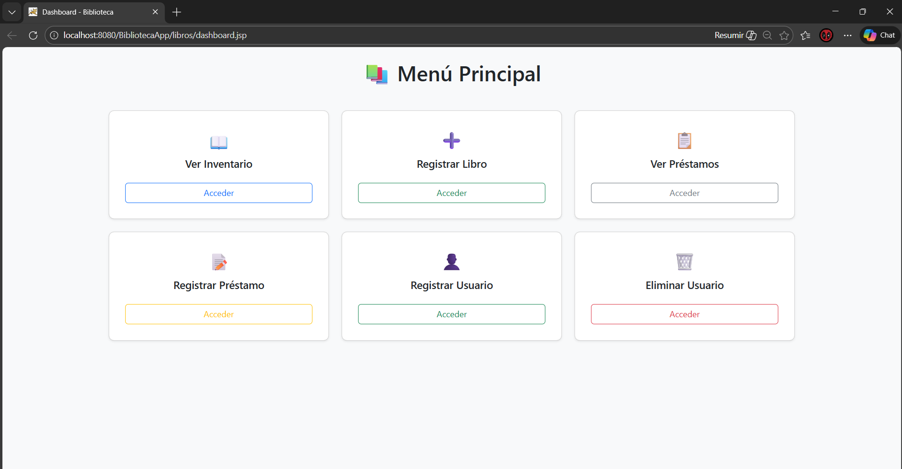
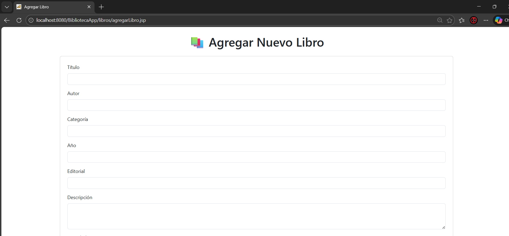
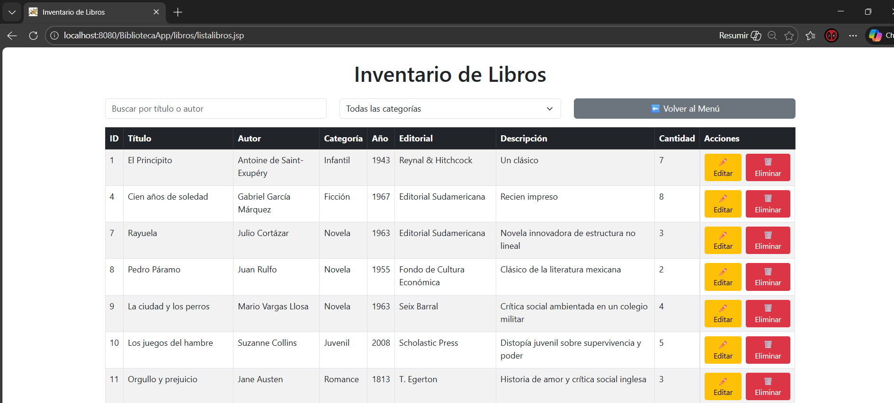
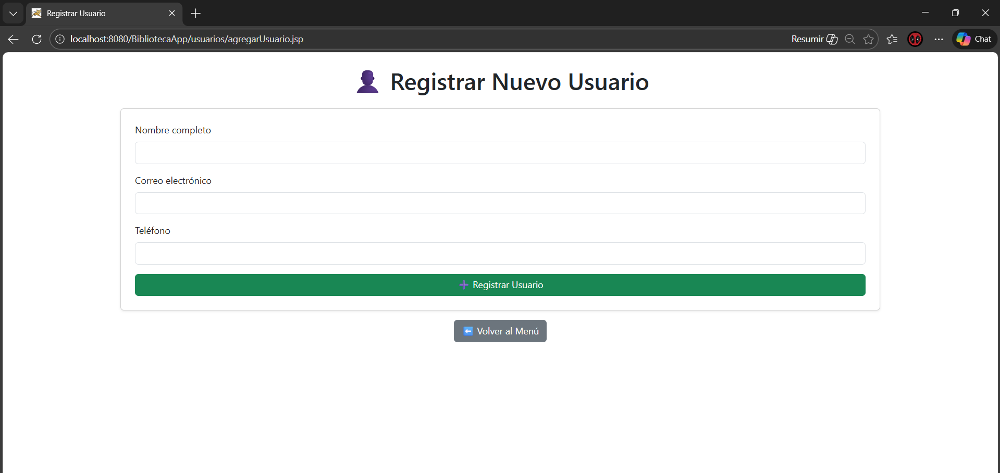
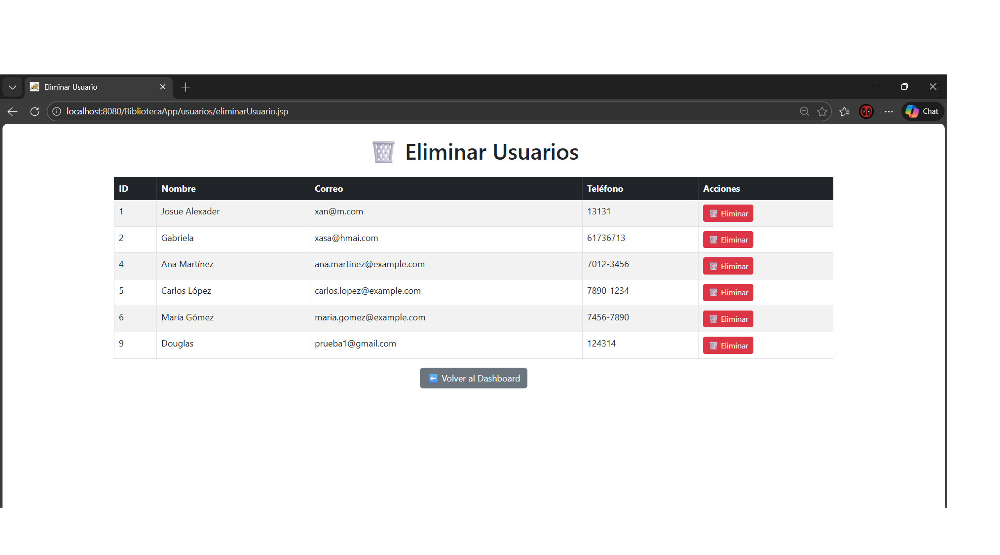
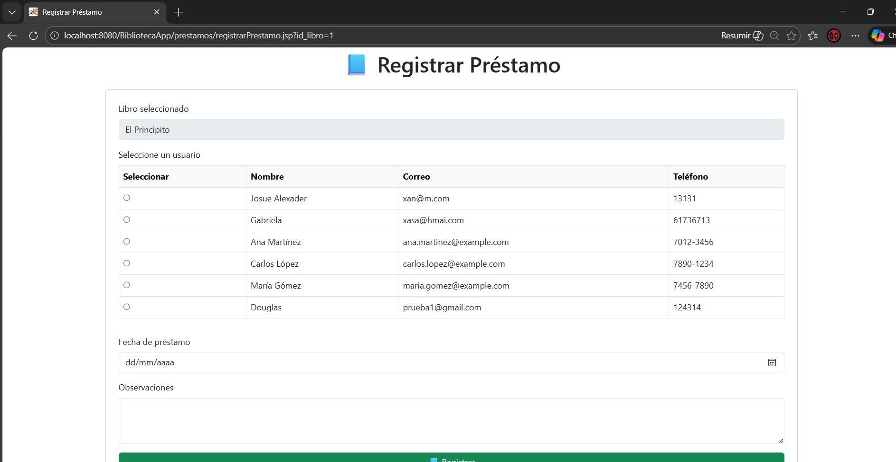
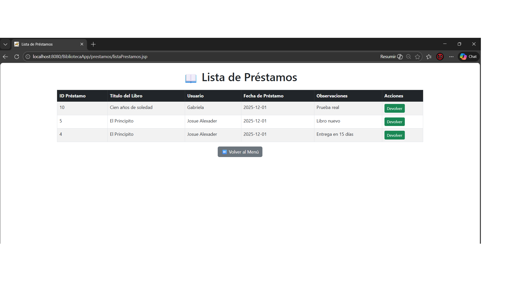

# Sistema de Gestión de Biblioteca

Proyecto académico/personal desarrollado en **Java** para administrar una biblioteca desde el lado del administrador.  
Incluye módulos para gestionar **libros, usuarios y préstamos**, aplicando principios de **programación orientada a objetos**, arquitectura en capas y conexión a base de datos relacional.

---

## Tecnologías utilizadas
- **Java 17**  
- **Jakarta Servlets (Tomcat 10+)**  
- **JSP (Java Server Pages)**  
- **Bootstrap 5** (interfaz web)  
- **JavaScript (AJAX/Fetch)**  
- **MySQL** (base de datos)  
- **Gson** (serialización JSON)  

---

## Funcionalidades principales
- CRUD de **Libros** (crear, listar, actualizar, eliminar).  
- CRUD de **Usuarios**.  
- Registro y gestión de **Préstamos**.  
- Control de disponibilidad de ejemplares.  
- Listado de préstamos con información del libro y usuario (JOIN).  
- APIs RESTful que devuelven datos en formato JSON.  
- Interfaz web con JSP + Bootstrap para administración.  

---

## Arquitectura
El proyecto sigue una arquitectura en capas:

- **Modelo (`model`)** → Clases `Libro`, `Usuario`, `Prestamo`.  
- **DAO (`dao`)** → Acceso a datos con JDBC (`LibroDAO`, `UsuarioDAO`, `PrestamoDAO`).  
- **Controlador (Servlets)** → Exposición de APIs REST y lógica de negocio.  
- **Vista (JSP)** → Interfaz web para el administrador.  

---
## Capturas de pantalla

### Dashboard principal

### Registro de nuevo libro

### Inventario de libros

### Registro de nuevo usuario

### Eliminación de usuario

### Registro de préstamo

### Lista de préstamos

